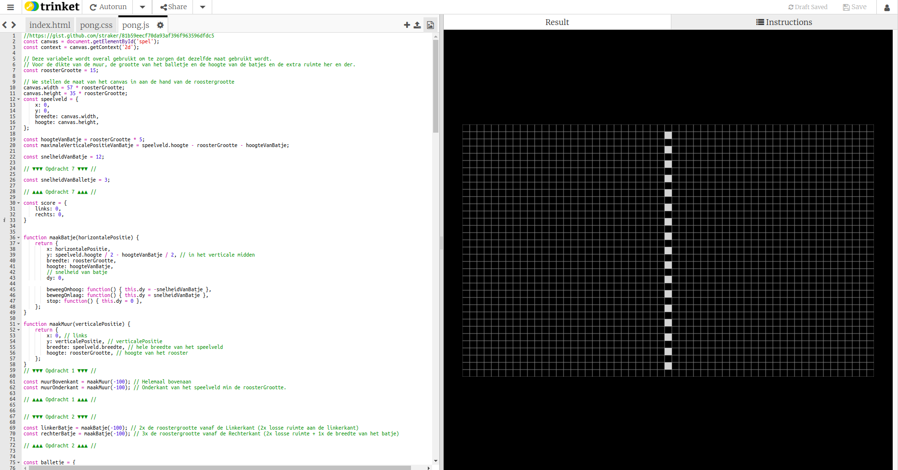
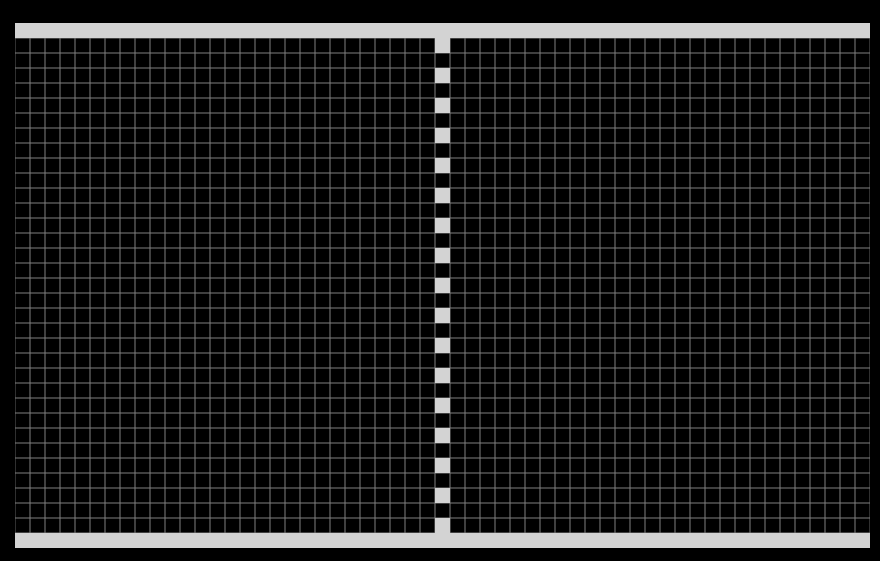
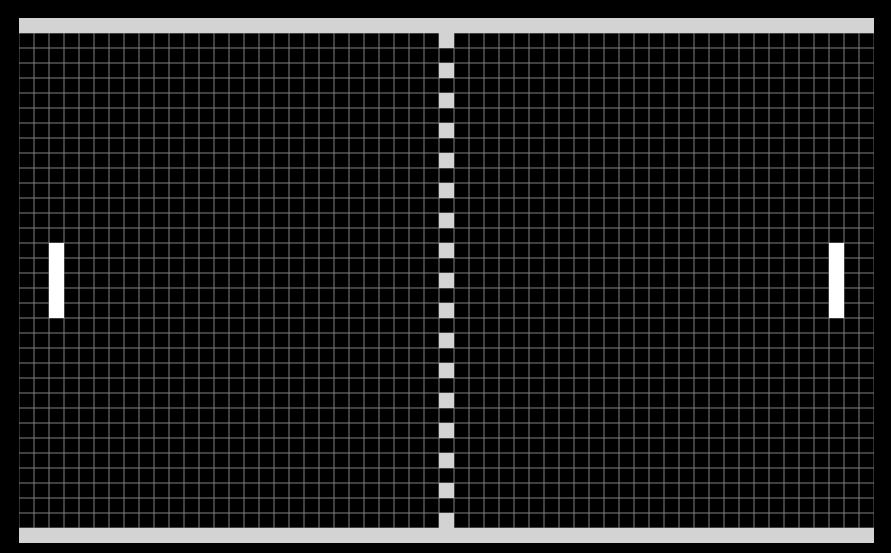
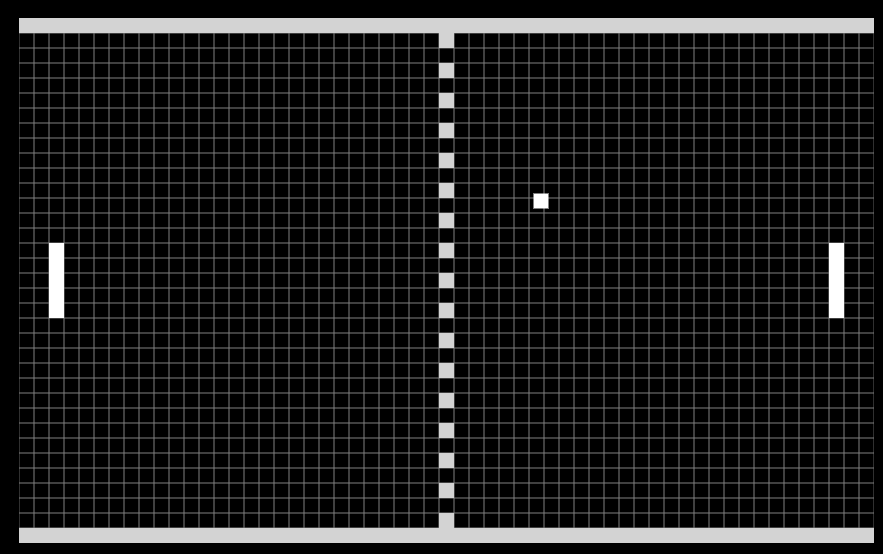
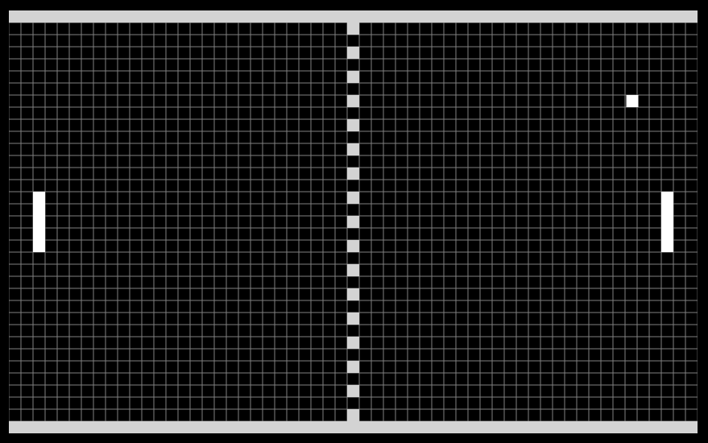
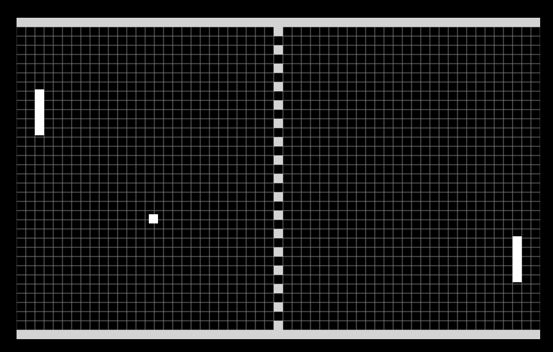
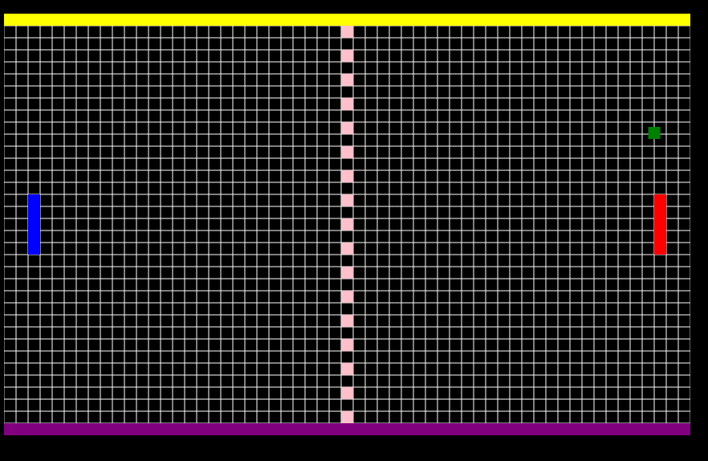
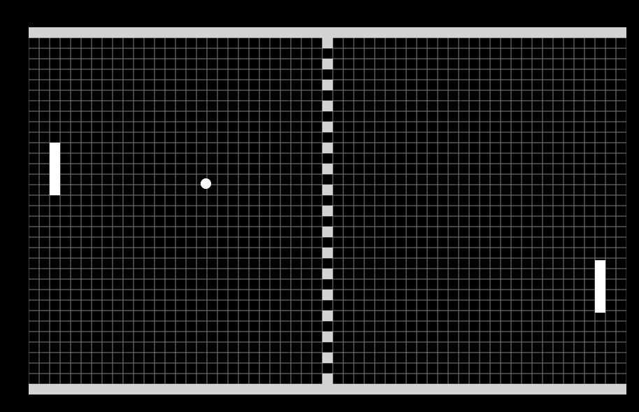
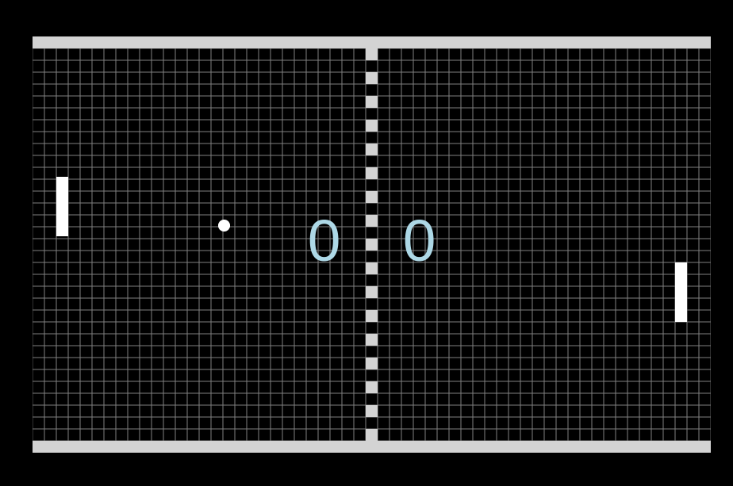
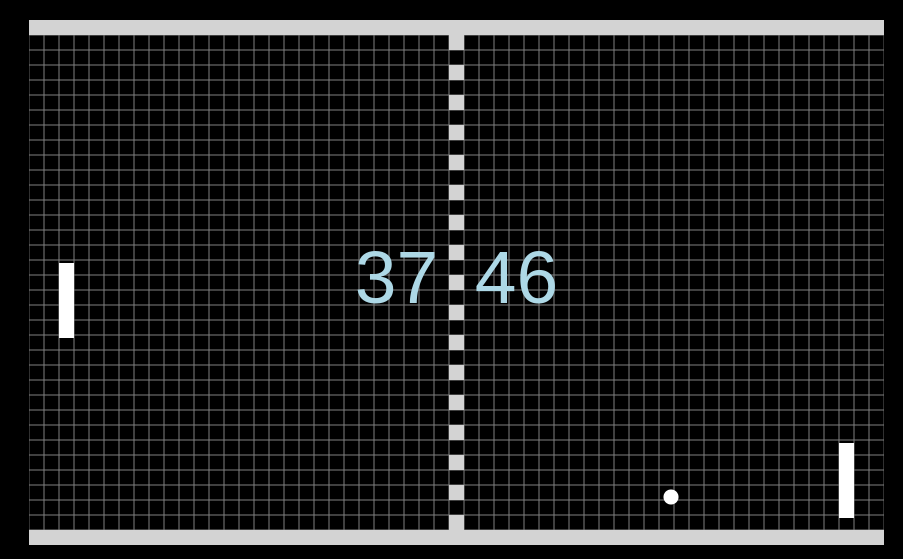

# Pong

Hallo! Vandaag gaan we het spel *Pong* maken, op de computer.

Op de computer kan je zelf dingen maken door het in *code* te typen. Dat noemen we ook wel *programmeren*. Wij gaan het spel *Pong* programmeren.

Het is moeilijk om dat helemaal zelf te leren. Daarom hebben de begeleiders van de CoderDojo Enschede alvast een begin gemaakt. Hieronder vind je instructies waarmee je stap voor stap aan de slag kan.

Elke opdracht bevat uitleg, en dingen die jij zelf moet doen. De dingen die jij zelf moet doen, staan aangegeven met `▶▶▶`.

### Opdracht 0: Openen van programmeeromgeving

De code staat in *Trinket*. Dat is een website waarop je kan programmeren, en direct het resultaat kan bekijken.

▶▶▶ Open Trinket door op de link te klikken: https://trinket.io/embed/html/8fb18a7459

Je moet nu aan de linker kant code zien, en aan de rechter kant het Pong spel.

Als je aan de linker kant de code aanpast, dan verandert de website automatisch na een paar seconden aan de rechterkant.

Dat was gemakkelijk! Nu komt het echte werk!

### Opdracht 1: Muren tekenen

Op de website staat nog niet zoveel. We gaan eerst het speelveld tekenen van Pong.

Pong heeft twee muren. Als de bal een muur raakt, dan stuitert hij terug. We gaan de muren tekenen, zodat de bal er straks tegenaan kan stuiteren.

▶▶▶ Zoek *Opdracht 1* in het bestand `pong.js`.

Hier staan twee regels met `maakMuur(...)`. De *functie* `maakMuur` maakt een muur. We moeten invullen in de functie welke coordinaat de bovenkant van de muur moet hebben. De coordinaten beginnen bij `0`, en eindigen bij `speelVeld.hoogte`.

Maar de getallen zijn verkeerd! Bij beide muren staat `-100` in plaats van de onderkant of de bovenkant van het veld.

▶▶▶ Vul `0` in voor de bovenste muur in `maakMuur`.

Er moet nu een muur verschijnen aan de bovenkant van het speelveld

▶▶▶ Vul `speelveld.hoogte` in voor de onderste muur in `maakMuur`.

Dat is raar, er gebeurt niets. We zien geen tweede muur aan de onderkant van het speelveld.

Dat komt omdat we een foutje hebben gemaakt. De coordinaat die de we invullen is de bovenkant van de muur, en `speelveld.hoogte` is het einde van het speelveld. We moeten rekening houden met de hoogte van de muur.

▶▶▶ Vul `speelveld.hoogte - roosterGrootte` in voor de onderste muur in `maakMuur`.

Nu moet er wel een muur aan de onderkant van het speelveld verschijnen.

### Opdracht 2: Batjes tekenen

Als we Pong gaan spelen, dan hebben we batjes nodig. De bal kan tegen een batje stuiteren, zodat hij terugkaatst naar de tegenstander.

Laten we de batjes op het scherm tekenen.

▶▶▶ Zoek *Opdracht 2* in het bestand `pong.js`.

Er staan twee regels met `maakBatje`. Net als de muren is `maakBatje` een functie die een batje maakt.

Ook hier staan de coordinaten verkeerd, ze staan op `-100`. We moeten de afstand vanaf de linkerkant van het speelveld invullen waar de batjes getekend moeten worden.

Het linker batje moet getekend worden op 2 keer de grootte van het rooster.

▶▶▶ Vul voor het linker batje `2 * roosterGrootte` in in de functie `maakBatje`.

Het rechter batje moet getekend worden op 3 keer de grootte van het rooster van de rechterkant van het speelveld. De rechterkant van het speelveld is `speelveld.breedte`. Houdt rekening met de dikte van het batje.

▶▶▶ Vul voor het linker batje `speelveld.breedte - 3 * roosterGrootte` in in de functie `maakBatje`.

### Opdracht 3: Een bal

Tot nu toe gebeurt er nog niet zoveel. Pong is wel erg saai als er niets beweegt.

Laten we een bal tekenen in het veld. Onze bal is vierkant.

▶▶▶ Zoek *Opdracht 3* in het bestand `pong.js`.

▶▶▶ Tussen de twee markeringen van `Opdracht 3`, vul `tekenVierkant('white', balletje);` in. Vergeet de `;` aan het einde niet.

De functie `tekenVierkant` tekent een vierkant op op het scherm. De functie roepen we aan met twee argumenten: `'white'` (wit in het Engels), de kleur van het balletje en `balletje`, wat bepaalt waar en hoe groot de bal wordt getekend op het scherm.

Nu moet er een balletje verschijnen op het scherm.

### Opdracht 4: Stuiterbal

De bal moet niet alleen bewegen, maar ook stuiteren! Nu schuift de bal langs de rand van het speelveld. Dat klopt niet!

▶▶▶ Zoek *Opdracht 4* in het bestand `pong.js`. Er staan twee opdrachten, *a* en *b*.

We kunnen de bal laten stuiteren door hem om te laten keren van ritchting als de bal de muur raakt. De bal heeft een functie `keerOm()` om de bal te laten omkeren.

▶▶▶ Zoek *Opdracht 4 (a)*. Hier raakt de bal de bovenste muur. Laat be bal omkeren door `balletje.keerOm();` aan te roepen.

▶▶▶ Zoek *Opdracht 4 (b)*. Hier raakt de bal de onderste muur. Laat be bal omkeren.

Nu moet de bal stuiteren als de bal de bovenste of onderste muur raakt.

### Opdracht 5: Toetsenbord

De batjes staan nu stil aan de linker- en rechterkant van het speelveld. De spelers moeten met toetsen op het toetsenbord de batjes kunnen bewegen.

In de code moeten we *luisteren* naar te toetsen van het toetsenbord. Als een speler een toets indrukt, dan kunnen wij een actie uitvoeren in de code, zoals het bewegen van het batje.

Voor het rechterbatje gebruiken we de pijltjestoetsen omhoog en omlaag. Voor het linkerbatje gebruiken we de toetsen `w` en `s`.

▶▶▶ Zoek *Opdracht 5* in het bestand `pong.js`. Er staan zes opdrachten, *a*, *b*, *c*, *d*, *e*, en *f*.

Per toetsaanslag gaan we het batje laten bewegen. Dat kan met de functies
- `rechterBatje.beweegOmhoog();`
- `rechterBatje.beweegOmlaag();`
- `rechterBatje.stop();`
- `linkerBatje.beweegOmhoog();`
- `linkerBatje.beweegOmlaag();`
- `linkerBatje.stop();`

▶▶▶ Zoek *Opdracht 5 (a)*. Hier wordt 🡹 (pijltje omhoog) ingedrukt op het toetsenbord. Roep de goede functie aan om het rechterbatje omhoog te laten bewegen.

▶▶▶ Zoek *Opdracht 5 (b)*. Hier wordt 🡻 (pijltje omlaag) ingedrukt op het toetsenbord. Roep de goede functie aan om het rechterbatje omlaag te laten bewegen.

▶▶▶ Zoek *Opdracht 5 (c)*. Hier wordt de toets `w` ingedrukt op het toetsenbord. Roep de goede functie aan om het linkerbatje te laten bewegen.

▶▶▶ Zoek *Opdracht 5 (d)*. Hier wordt de toets `s` ingedrukt op het toetsenbord. Roep de goede functie aan.

We hebben de toetsen afgehandeld om te batjes te laten bewegen. Probeer maar eens!

Zoals je kan zien, stoppen de batjes nooit meer met bewegen. Het batje moet stoppen met bewegen zodra een toets wordt *losgelaten*.

▶▶▶ Zoek *Opdracht 5 (e)*. Hier wordt een pijltjestoets losgelaten op het toetsenbord. Roep de goede functie aan.

▶▶▶ Zoek *Opdracht 5 (f)*. Hier worden te toetsen `w` of `s` losgelaten op het toetsenbord. Roep de goede functie aan.

Probeer de batjes te bewegen in het spel. Als je de pijtjestoetsen of `w` of `s` indrukt beweegt het batje. Als je te toetsen loslaat, dan stopt het batje met bewegen.

### Opdracht 6: Wijzigen van toetsen

In opdracht 5 hebben we de batjes laten bewegen. De toetsen waren `w` en `s` voor het linkerbatje.

Laten we de toetsen wijzigen waarmee het linkerbatje gaat bewegen, bijvoorbeeld naar `q` en `a`.

▶▶▶ Zoek *Opdracht 6* in het bestand `pong.js`. Er staan drie opdrachten, *a*, *b* en *c*.

▶▶▶ Bij *Opdracht 6 (a)*. Wijzig de toets `w` naar `q` om het linker batje omhoog te laten bewegen.

▶▶▶ Bij *Opdracht 6 (b)*. Wijzig de toets `s` naar `a` om het linker batje omlaag te laten bewegen.

▶▶▶ Bij *Opdracht 6 (c)*. Wijzig de toets `w` naar `q` en `s` naar `a` om het linker batje te laten stoppen.

### Opdracht 7: Snelheid

De bal heeft een vaste snelheid. We kunnen de snelheid aanpassen zodat de bal langzamer of sneller beweegt.

▶▶▶ Zoek *Opdracht 7* in het bestand `pong.js`.

Hier staat een waarde `3`. We kunnen de waarde aanpassen naar iets anders om de snelheid van de bal te veranderen.

▶▶▶ Verander de snelheid van de bal naar `1`.

▶▶▶ Verander de snelheid van de bal naar `10`.

▶▶▶ Verander de snelheid van de bal naar `30`.

Kan je het spel nog spelen?

▶▶▶ Verander de snelheid van de bal naar `0`. Wat gebeurt er?

### Opdracht 8: Richting van de bal

Als het spel begint, gaat de bal altijd naar rechtsboven. We kunnen de bal ook naar linksboven, linksonder of rechtsonder laten beginnen.

▶▶▶ Zoek *Opdracht 8* in het bestand `pong.js`.

Er staan twee variabelen: `dx` en `dy`. De variabelen bepalen welke kant de bal op beweegt. Standaard begint de bal naar rechts (`dx` is positief) en naar boven (`dy` is negatief, door de `-`).

▶▶▶ Zet een `-` bij de `dx` erbij. Welke kant gaat de bal op?

▶▶▶ Haal de `-` bij de `dy` weg. Welke kant gaat de bal op?

▶▶▶ Haal de `-` bij de `dx` weer weg. Welke kant gaat de bal op?

### Opdracht 9: Kleuren

Ons Pong spel is zwart en wit, met grijs erbij. Dat is een beetje saai. Laten we het spel wat mooier maken door kleurtjes toe te voegen aan de bal, de muren en de batjes.

▶▶▶ Zoek *Opdracht 9* in het bestand `pong.js`. (Let op, dit zijn meerdere regels.)

Hier worden meerdere functies aangeroepen die dingen tekenen in het spel. Je kan elk onderdeel dat wordt getekend een andere kleur geven door de naam van de kleur op te geven.

▶▶▶ Verander de kleur van de bovenste muur naar `'red'` (*red* is rood in het Engels).

Kan je zien dat de muur rood wordt?

▶▶▶ Open in een nieuw tabblad de website https://htmlcolorcodes.com/color-names/.

Op de website staat een lijst van kleuren met namen. Al deze namen kan je gebruiken als kleurtje.

▶▶▶ Verander de kleur van de bovenste muur, de onderste muur, het linker batje, het rechter batje en van de bal.

### Opdracht 10: Ronde bal

De bal is een vierkant blokje. Eigenlijk is dat vreemd want ballen zijn meestal rond. Laten we onze Pong bal ook rond maken.

▶▶▶ Zoek *Opdracht 10* in het bestand `pong.js`.

Hier staat dat `balletje` als een vierkant wordt getekend.

▶▶▶ Verander de functie aanroep `tekenVierkant` naar `tekenCirkel`.

De bal moet nu als een cirkel worden getekend.

### Opdracht 11: Score tonen

Als een van de spelers een punt scoort, dan begint de bal overnieuw in het midden. Maar we zien niet wie er voor staat.

We gaan de score van de spelers tonen in het speelveld.

▶▶▶ Zoek *Opdracht 11* in het bestand `pong.js`.

Er is een functie `tekenTekst(...)`. Die functie kan tekst tekenen in het speelveld. De argumenten zijn als volgt:
1. De kleur van de tekst.
2. De x-cooördinaat van (het midden van) de tekst.
3. De grootte van de tekst.
4. De tekst.

▶▶▶ Roep de functie `tekenTekst` aan om de score van de linker speler te tekenen:`tekenTekst('lightblue', speelveld.breedte / 2 - 4 * roosterGrootte, roosterGrootte * 5, score.links);`.

Je mag de argumenten variëren. Zie je het getal *0* verschijnen in het speelveld?

▶▶▶ Roep de functie `tekenTekst` aan om de score van de rechter speler te tekenen. Bepaal zelf welke argumenten moeten veranderen om de score op de juiste plek te krijgen.

Nu moeten beide spelers een score in het speelveld hebben staan.

### Opdracht 12: Score tellen

We tonen nu de scores van de spelers, maar er staat altijd *0* in beeld. We moeten de score tellen als er een punt wordt gescoort.

▶▶▶ Zoek *Opdracht 12* in het bestand `pong.js`.

Er staat een `if` en een `else if`. Daarbinnen kan de score van elke speler worden opgehoogd.

Je kunt een speler een punt geven door `score.links += 1;` of `score.rechts += 1;` te typen.

▶▶▶ Zet in de `if` en in de `else if` binnen de `{` en `}` de code neer om de punten op te hogen van de spelers, als er wordt gescoort.

▶▶▶ Probeer de speler 10 punten te geven als er wordt gescoret, in plaats van één punt.

Zie je dat de score wordt opgehoogd als een speler een punt scoort? Goed zo!

